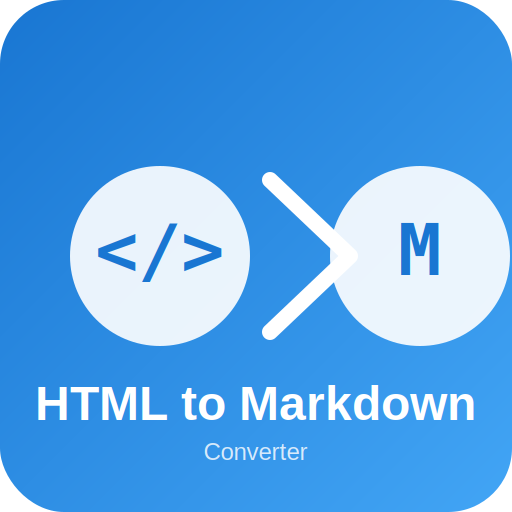

# HTML to Markdown Converter

A modern, feature-rich web application that converts HTML content to Markdown format with real-time preview. Built with React and Material-UI for a professional, responsive user experience.



## 🎯 Project Objective

The HTML to Markdown Converter is designed to help developers, content creators, and technical writers easily convert HTML content to Markdown format. It serves two primary use cases:

1. **Direct HTML Input**: Paste HTML code directly into the application for instant conversion
2. **Web Page Conversion**: Extract content from web pages by URL, automatically clean navigation elements, and convert to Markdown

## ✨ Features

### 🔤 HTML Text Conversion

- **Real-time Conversion**: Instant HTML to Markdown conversion as you type
- **Smart Detection**: Automatically detects HTML content and converts accordingly
- **Format Preservation**: Maintains heading structure, lists, links, and formatting

### 🌐 Web Page Content Extraction

- **URL Input**: Simply paste a web page URL to fetch content
- **Content Cleaning**: Automatically removes navigation menus, headers, footers, and other non-content elements
- **Smart Extraction**: Focuses on main content areas (main, article, .content, etc.)

### 📝 Markdown Preview

- **Live Preview**: Real-time rendering of converted Markdown
- **Syntax Highlighting**: Proper formatting for headings, bold, italic, code, and lists
- **Responsive Display**: Optimized for all screen sizes

### 🎨 Modern UI/UX

- **Material Design**: Built with Material-UI for consistent, professional appearance
- **Responsive Layout**: Works perfectly on desktop, tablet, and mobile devices
- **Dark/Light Theme**: Clean, modern interface with proper contrast
- **Custom Branding**: Professional logo and favicon representing the conversion process

### 🛠️ Additional Tools

- **Copy to Clipboard**: One-click copying of converted Markdown
- **Download Markdown**: Save converted content as .md files
- **Clear All**: Reset all inputs with a single click
- **Error Handling**: Clear error messages for failed operations

## 🚀 Getting Started

### Prerequisites

- Node.js (version 14 or higher)
- npm or yarn package manager

### Installation

1. **Clone the repository**

   ```bash
   git clone <repository-url>
   cd html2md
   ```

2. **Install dependencies**

   ```bash
   npm install
   ```

3. **Start the development server**

   ```bash
   npm start
   ```

4. **Open your browser**
   Navigate to [http://localhost:3000](http://localhost:3000)

### Building for Production

```bash
npm run build
```

This creates an optimized production build in the `build` folder.

## 🎯 Usage

### Converting HTML Text

1. **Paste HTML Content**: Copy HTML code and paste it into the "HTML Text Input" field
2. **View Conversion**: The Markdown preview updates automatically
3. **Copy or Download**: Use the copy button or download the converted Markdown

### Converting Web Pages

1. **Enter URL**: Paste a web page URL into the "URL Input" field
2. **Fetch Content**: Click the "Fetch" button to retrieve and process the web page
3. **Review Extraction**: View the cleaned HTML content below the URL input
4. **Get Markdown**: The converted Markdown appears in the preview panel

### Example HTML Input

```html
<h1>Welcome to My Blog</h1>
<p>This is a <strong>sample</strong> blog post with <em>formatted</em> text.</p>
<ul>
  <li>First item</li>
  <li>Second item</li>
</ul>
```

### Example Markdown Output

```markdown
# Welcome to My Blog

This is a **sample** blog post with _formatted_ text.

- First item
- Second item
```

## 🛠️ Technology Stack

- **Frontend Framework**: React 19.1.1
- **UI Library**: Material-UI (MUI) v7.3.1
- **HTML Conversion**: Turndown.js
- **Styling**: Emotion (CSS-in-JS)
- **Build Tool**: Create React App
- **Package Manager**: npm

## 📁 Project Structure

```
html2md/
├── public/
│   ├── favicon.svg          # Custom favicon
│   ├── logo192.svg          # 192x192 app icon
│   ├── logo512.svg          # 512x512 app icon
│   ├── manifest.json        # PWA manifest
│   └── index.html           # Main HTML file
├── src/
│   ├── App.js               # Main application component
│   ├── App.css              # Custom styles
│   ├── index.js             # Application entry point
│   ├── index.css            # Global styles
│   └── theme.js             # Material-UI theme configuration
├── package.json             # Dependencies and scripts
└── README.md                # This file
```

## 🎨 Customization

### Theme Colors

The application uses a custom Material-UI theme with a professional blue color scheme:

- **Primary**: #1976d2 (Material Blue)
- **Secondary**: #42a5f5 (Light Blue)
- **Background**: #fafafa (Light Gray)

### Logo Design

The custom logo represents the conversion process:

- **HTML Symbol**: `</>` in a blue circle
- **Conversion Arrow**: Right-pointing arrow
- **Markdown Symbol**: "M" in a blue circle
- **Brand Name**: "HTML to Markdown"

## 🌐 Browser Support

- **Chrome**: 90+
- **Firefox**: 88+
- **Safari**: 14+
- **Edge**: 90+

## 📱 Progressive Web App (PWA)

The application is configured as a PWA with:

- **App Manifest**: Proper metadata for installation
- **Service Worker**: Offline capabilities (when implemented)
- **Responsive Design**: Works on all device sizes
- **Install Prompt**: Can be added to home screen

## 🤝 Contributing

1. Fork the repository
2. Create a feature branch (`git checkout -b feature/amazing-feature`)
3. Commit your changes (`git commit -m 'Add some amazing feature'`)
4. Push to the branch (`git push origin feature/amazing-feature`)
5. Open a Pull Request

## 📄 License

This project is licensed under the MIT License - see the [LICENSE](LICENSE) file for details.

## 🙏 Acknowledgments

- **Turndown.js**: For reliable HTML to Markdown conversion
- **Material-UI**: For the beautiful, accessible component library
- **Create React App**: For the excellent development experience

## 📞 Support

If you encounter any issues or have questions:

- Create an issue in the GitHub repository
- Check the browser console for error messages
- Ensure you're using a supported browser version

---

**Made with ❤️ using React and Material-UI**
